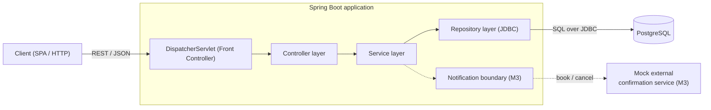

# Architecture

## Block diagram

Solid arrows are the request path built in Milestone 1. Dashed elements (the
notification boundary and the mock external service) are the Milestone 3
extension, shown here to mark the external-service boundary.

## Layers

| Layer | Package | Responsibility |
| --- | --- | --- |
| Front Controller | *(Spring)* | `DispatcherServlet` receives every request and routes it to a handler |
| Controller | `controller` | HTTP mapping, parameter binding, input validation |
| Service | `service` | Business logic; assembles DTOs (e.g. wraps results in a page) |
| Repository | `repository` | SQL over `JdbcTemplate` / `NamedParameterJdbcTemplate` |
| Database | PostgreSQL | Tables, constraints, and the double-booking guard |

DTOs (`dto`) cross the wire; `model`, `config`, and `notification` round out the
layered package structure. See [request-flow.md](request-flow.md) for a request
traced through the layers.

## Constraints

- Java + Spring Boot; **SQL over JDBC, no ORM**.
- Liquibase is the only database initializer.
- The database is the final authority on double-booking (see [schema.md](schema.md)).
