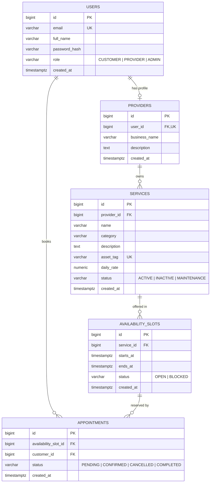

# ER Diagram

```mermaid
erDiagram
    USERS ||--o| PROVIDERS : "has profile"
    USERS ||--o{ APPOINTMENTS : "books"
    PROVIDERS ||--o{ SERVICES : "owns"
    SERVICES ||--o{ AVAILABILITY_SLOTS : "offered in"
    AVAILABILITY_SLOTS ||--o{ APPOINTMENTS : "reserved by"

    USERS {
        bigint id PK
        varchar email UK
        varchar full_name
        varchar password_hash
        varchar role "CUSTOMER | PROVIDER | ADMIN"
        timestamptz created_at
    }

    PROVIDERS {
        bigint id PK
        bigint user_id FK,UK
        varchar business_name
        text description
        timestamptz created_at
    }

    SERVICES {
        bigint id PK
        bigint provider_id FK
        varchar name
        varchar category
        text description
        varchar asset_tag UK
        numeric daily_rate
        varchar status "ACTIVE | INACTIVE | MAINTENANCE"
        timestamptz created_at
    }

    AVAILABILITY_SLOTS {
        bigint id PK
        bigint service_id FK
        timestamptz starts_at
        timestamptz ends_at
        varchar status "OPEN | BLOCKED"
        timestamptz created_at
    }

    APPOINTMENTS {
        bigint id PK
        bigint availability_slot_id FK
        bigint customer_id FK
        varchar status "PENDING | CONFIRMED | CANCELLED | COMPLETED"
        timestamptz created_at
    }
```

`UK` = unique, `PK` = primary key, `FK` = foreign key. Relationship cardinalities
and constraints are explained in [schema.md](schema.md).
