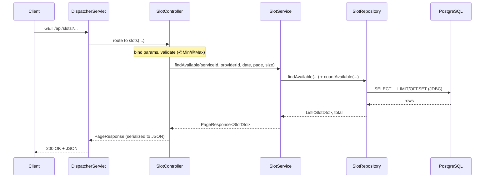

# Request Flow & Controller Pattern

## Request flow through the layers

Tracing `GET /api/slots?serviceId=1&date=2026-09-06&page=0&size=20`:

1. **DispatcherServlet** (Spring's front controller) receives the request and
   selects the handler by URL and HTTP method.
2. **SlotController** binds the query parameters, applies Bean Validation
   (`@Min`/`@Max`), and calls the service. Invalid input is turned into a
   `400 Bad Request` by `GlobalExceptionHandler`.
3. **SlotService** asks the repository for one page of results plus the total
   count, and wraps them in a `PageResponse`.
4. **SlotRepository** runs parameterized SQL over JDBC — a filtered query with
   `LIMIT`/`OFFSET`, and a matching `count(*)`.
5. Rows map to `SlotDto`; the DTO page returns up the stack and is serialized to
   JSON by the DispatcherServlet.

Files: [`SlotController`](../src/main/java/com/cmpe172/rental/controller/SlotController.java)
→ [`SlotService`](../src/main/java/com/cmpe172/rental/service/SlotService.java)
→ [`SlotRepository`](../src/main/java/com/cmpe172/rental/repository/SlotRepository.java).

## Page Controller vs Front Controller

- **Page Controller** — one controller per page/action, typically rendering
  server-side HTML (e.g. Thymeleaf). The URL maps more or less directly to a
  page handler that produces markup.
- **Front Controller** — a single entry point receives *every* request and
  dispatches to the right handler. Cross-cutting concerns (routing, parsing,
  validation, serialization) live in that one place.

**This project uses the Front Controller pattern.** It exposes a REST/JSON API
intended for an SPA client, and Spring Boot's **`DispatcherServlet`** is the
front controller: all `/api/**` requests enter through it and are dispatched to
`@RestController` handlers that return DTOs (serialized to JSON), not rendered
HTML pages. There is no server-rendered page layer, so the Page Controller
pattern does not apply here.
